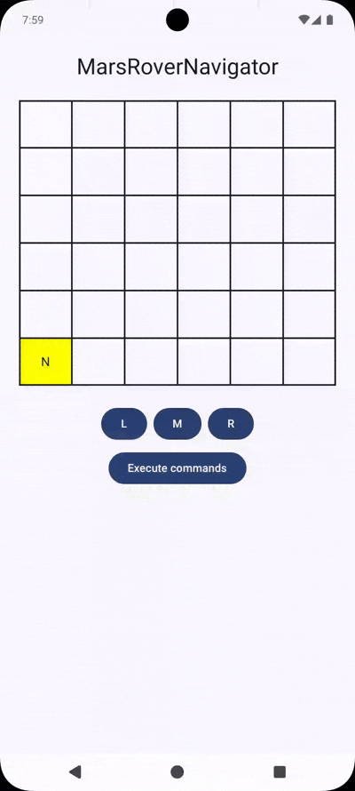

# Mars Rover Navigator

A modular Android application that simulates controlling a Mars Rover using Jetpack Compose, Clean Architecture, and MVI pattern.

---

## Launching the Project

### Requirements

- Android Studio Giraffe or newer
- JDK 17
- Kotlin 2.x
- Gradle 8.x
- Min SDK: 26
- Compile SDK: 34

### Getting Started

```bash
git clone https://github.com/ernest75/mars-rover-navigator.git
cd mars-rover-navigator
./gradlew sync
./gradlew assembleDebug
```

Then run the app from Android Studio or:

```bash
./gradlew installDebug
```

---

## Project Architecture

This project follows **Clean Architecture** and the **MVI** (Model-View-Intent) pattern.

```
app/
├── feature/
│   └── navigation/
│       ├── view/                # UI (Jetpack Compose)
│       ├── RoverControllerViewModel.kt
│       ├── RoverControllerScreenState.kt
│       └── RoverControllerIntent.kt
├── domain/                      # UseCases & Business Logic
├── data/                        # Repositories, DTOs, Mappers
├── core/                        # Shared utilities & platform abstractions
└── view/                        # Design system, themes, shared UI components
    ├── theme/
    ├── components/
    └── resources/
```

---

## Key Decisions

- **MVI Pattern**: To ensure unidirectional data flow and predictable state management.
- **Jetpack Compose**: Modern UI toolkit for building declarative UIs.
- **Modular Architecture**: Separation of concerns and improved scalability.
- **Paparazzi**: For screenshot testing without emulators.
- **MockK**: For mocking and verifying behavior in unit tests.

---

## Third-Party Libraries

### Frameworks

- **Hilt**: Used for Dependency Injection, reducing boilerplate and managing object lifecycles cleanly.

### Testing

- **JUnit 5**: Modern testing framework for writing and running unit tests.
- **JUnit 4**: Still used in combination with Paparazzi, which relies on it for screenshot testing.
- **MockK**: Provides mocking capabilities for Kotlin, used extensively in unit tests.
- **Paparazzi**: Enables screenshot testing without the need for emulators or devices.

---

## Testing

### Unit Tests

```bash
./gradlew testDebugUnitTest
```

### Screenshot Tests (Paparazzi)

```bash
./gradlew verifyPaparazzi
```

Or record new references:

```bash
./gradlew recordPaparazzi
```

---

## CI/CD

This project uses GitHub Actions to automatically run unit tests and screenshot tests on each Pull Request.

### CI Workflow

- Runs on PRs targeting the `master` branch
- Executes:
  - Unit tests with `./gradlew testDebugUnitTest`
  - Paparazzi screenshot tests with `./gradlew screenshotTests`

Workflow config can be found under `.github/workflows/`.

---

## Platform Libraries

- **Jetpack Compose**: Official Android UI toolkit for building declarative UIs.
- **Kotlinx Coroutines**: Official JetBrains library enabling structured concurrency and asynchronous programming.

## Screenshot Testing

- Paparazzi is used for screenshot testing Jetpack Compose UI components without the need for an emulator or physical device.
- Screenshots are generated and compared against golden images to detect visual regressions.

## Considerations

- The app supports both Light and Dark modes and adapts UI elements accordingly using dynamic theming.

- A small delay has been added to all network-like responses (initial contact and command submission) to simulate real-world request latency.

- ViewModel logic, UseCases, Repository implementations, Mappers, and Fake API have been unit tested to ensure isolated business logic and correct data flow.

- The plateau grid is dynamic based on the top-right coordinates.

- Intents are passed through the ViewModel for full MVI conformance.

- Coroutine testing uses JUnit5 + `StandardTestDispatcher`.

- UI tests are implemented using the Robot pattern to improve readability, reusability, and maintainability of interaction logic.

---

## App Flow

- On app launch, an initial request ("initial contact") is automatically triggered.
- This request fetches the default Mars plateau size, rover's starting position, and its facing direction.
- Once the data is received, the UI is rendered based on the returned state.
- Users can then interact using `L`, `M`, and `R` command buttons to rotate or move the rover.
- After entering commands, tapping the "Send Command" button triggers a request which updates the rover's position and direction based on the inputs.

## Preview




